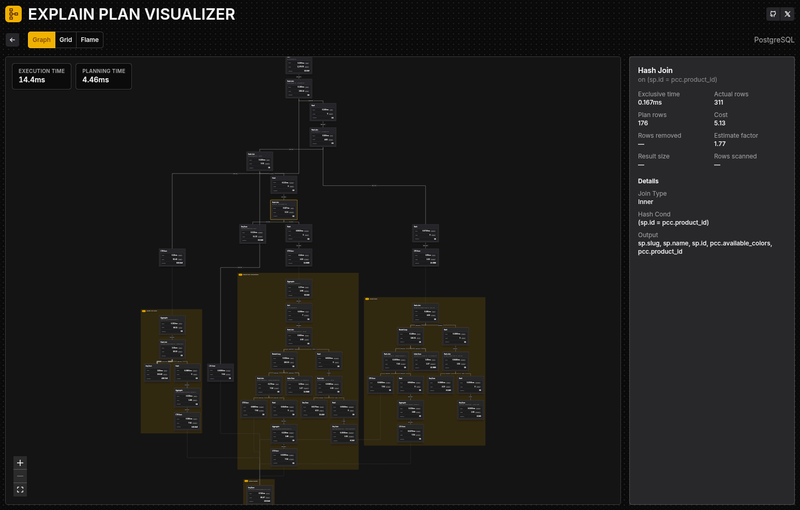

# Explain Plan Visualizer

Explain Plan Visualizer is a small, in-browser tool that turns database `EXPLAIN` output into an interactive graph and details view. Everything runs locally in your browser, so plan data never leaves your device.



**Highlights**
- Visualize query plans as an interactive graph.
- Inspect node details for deeper analysis.
- Runs entirely in-browser with zero data upload.

**Supported Databases**
- PostgreSQL
- DuckDB

**How To Get A Plan**
PostgreSQL:
```sql
EXPLAIN (ANALYZE, FORMAT JSON, VERBOSE, BUFFERS)
[your-query]
```

DuckDB:
```sql
EXPLAIN (ANALYZE, FORMAT JSON)
[your-query]
```

**Quickstart**
```bash
bun install
bun run app:dev
```
Vite will print the local URL after the dev server starts.

**Handy Commands**
- `bun run app:dev` start the app dev server
- `bun run app:build` typecheck + build the frontend
- `bun run app:lint` lint the frontend
- `bun run app:fix` format and fix the frontend
